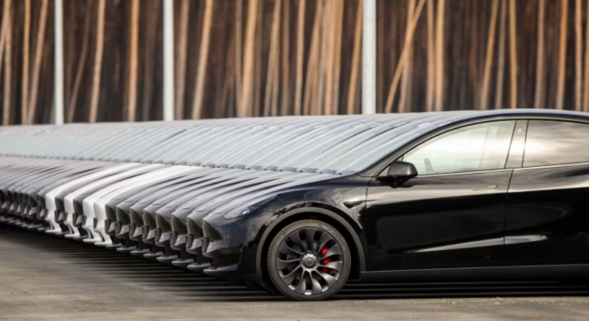

```{r setup, include=FALSE}
knitr::opts_chunk$set(echo = FALSE)
```

Firms do and should see climate change as a competitive opportunity, rather than a regulatory burden. Read [my article in the Financial Times](https://www.ft.com/content/30747917-d28e-4011-bdf8-a8854809cc1a) summarising [research](https://www.aeaweb.org/articles?id=10.1257/aeri.20210014) with Philippe Aghion, Roland Benabou and Alexandra Roulet.

Am talking about the same paper in this [VLOG](https://lawecon.ethz.ch/news-and-events/news-channel/2023/01/cle-vlog-about-the-influence-of-environmental-concerns-market-competition-on-innovation-with-prof-ralf-martin-icl.html) produced by the ETH.


