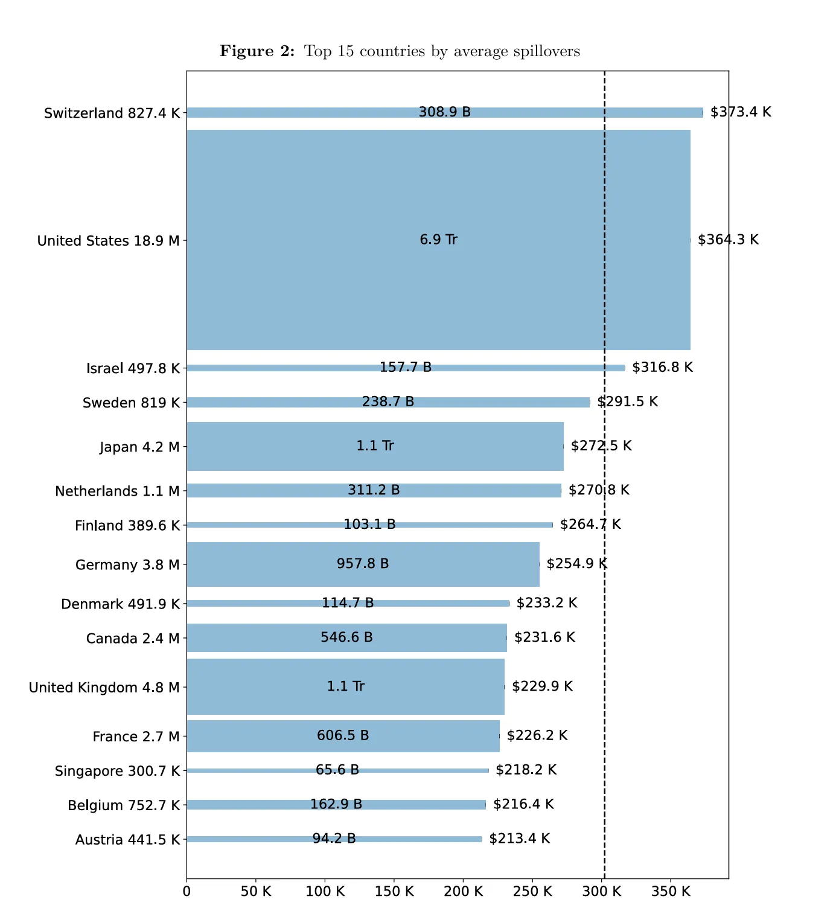
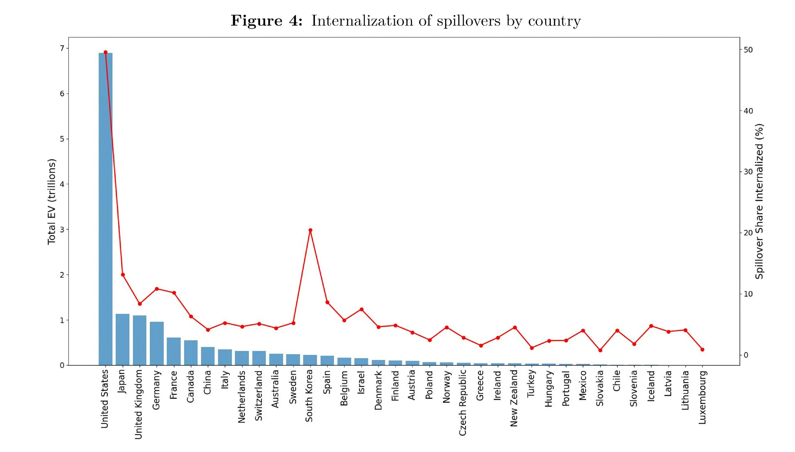
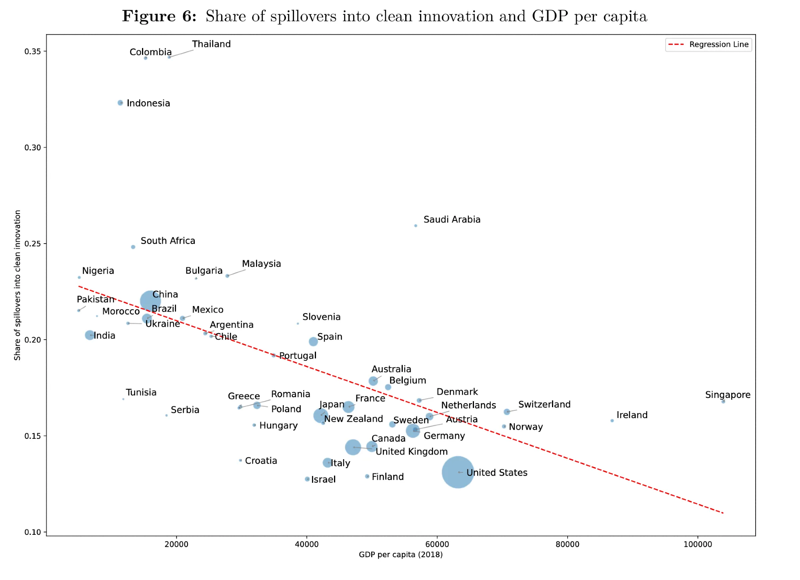
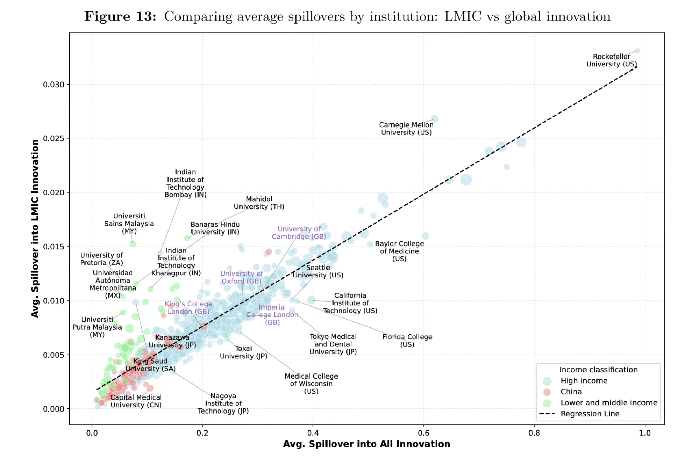

```{r setup, include=FALSE}
knitr::opts_chunk$set(echo = FALSE)
```

A new working paper -- **[Spillovers from Science](https://cep.lse.ac.uk/_new/publications/abstract.asp?index=12101)**
-- with Anna Valero, Arjun Shah and Dennis Verhoeven introduces **Science Rank**:
a new indicator that uses the combined patent and paper citation network to
assign a share of the private value of patented inventions to the scientific
papers they build upon.

We can think of this as an estimate of the value of knowledge spillovers from
academic research to commercial patents.

We document a number of stylised facts:

### 1. The US generates the largest amount of spillovers

The US produces the largest amount of spillovers overall and the second highest
on average -- after Switzerland.



### 2. Retention rates differ sharply across countries

Total spillovers from science vary across countries, and so does the share that
is retained within the borders of a country: the retention rate is nearly 70%
in the US whereas it is below 20% in most other countries. An outlier is South
Korea with a retention rate of 30%.



### 3. Developing-country research is greener

While developing countries typically generate lower amounts of spillovers
overall, a larger share of their spillovers support clean tech innovation.



### 4. Local universities matter for local innovators

Many universities in developing countries, while generating lower spillovers on
a global level, tend to generate relatively high spillovers for innovations by
developing-country innovators.



### Implications

While we need further evidence to draw strong causal conclusions, these results
are consistent with the idea that further development of research universities
in developing countries could help generate more innovation -- and thus
economic growth and employment -- for firms in developing countries.

Read the full paper:
**[Spillovers from Science (CEP Discussion Paper)](https://cep.lse.ac.uk/_new/publications/abstract.asp?index=12101)**.
