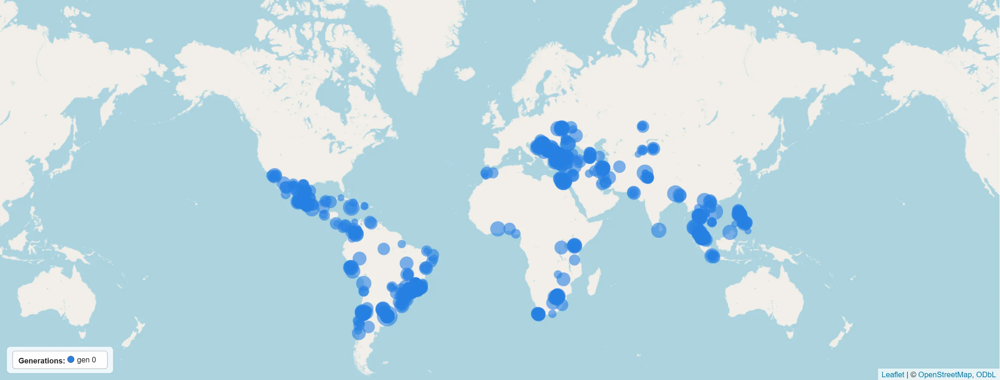
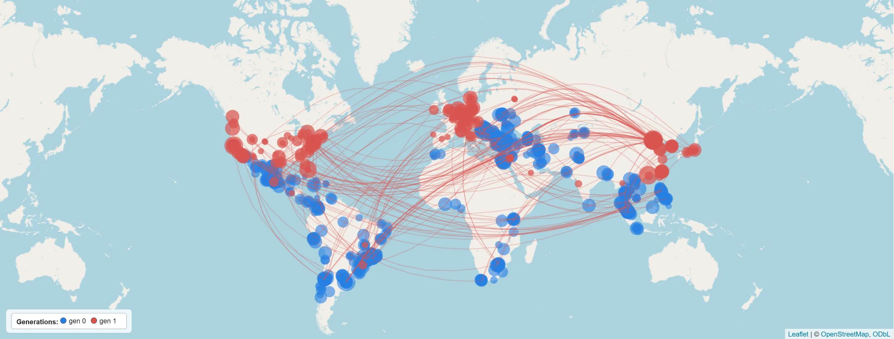
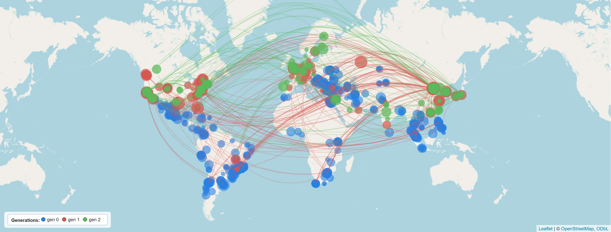

```{r setup, include=FALSE}
knitr::opts_chunk$set(echo = FALSE)
```

I've launched **[HiGGlo](https://tinyurl.com/higglo)** -- a new tool to visualise
innovations and the direct and indirect knowledge spillovers between them.

As a first illustration, the map below shows the **1000 Green Tech innovations
from developing countries that generate the highest value spillovers**:



A random sample of the spillovers they generate **directly**:



...and **indirectly**:



Explore the tool here: **[HiGGlo](https://tinyurl.com/higglo)**.
