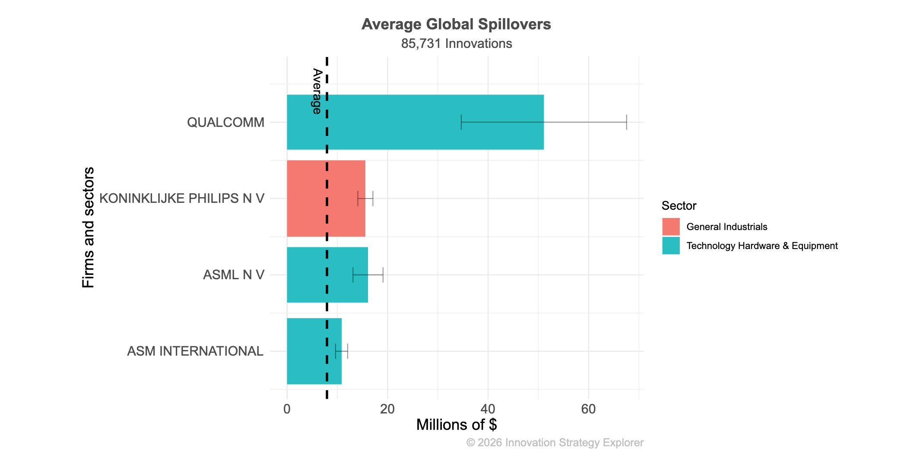
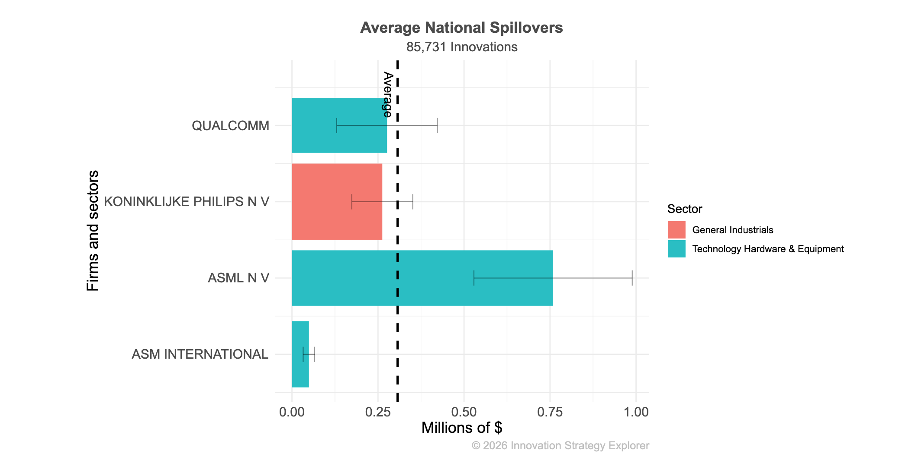
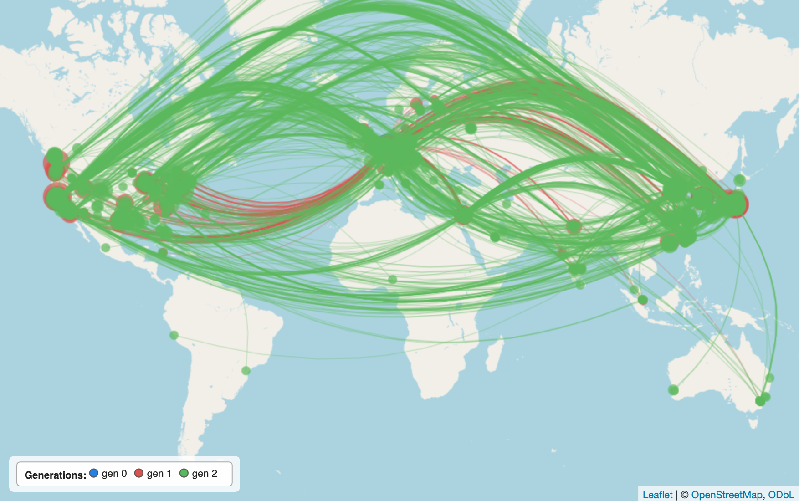
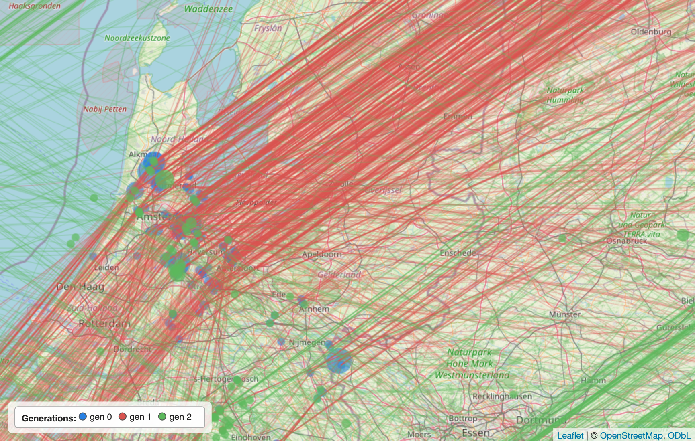
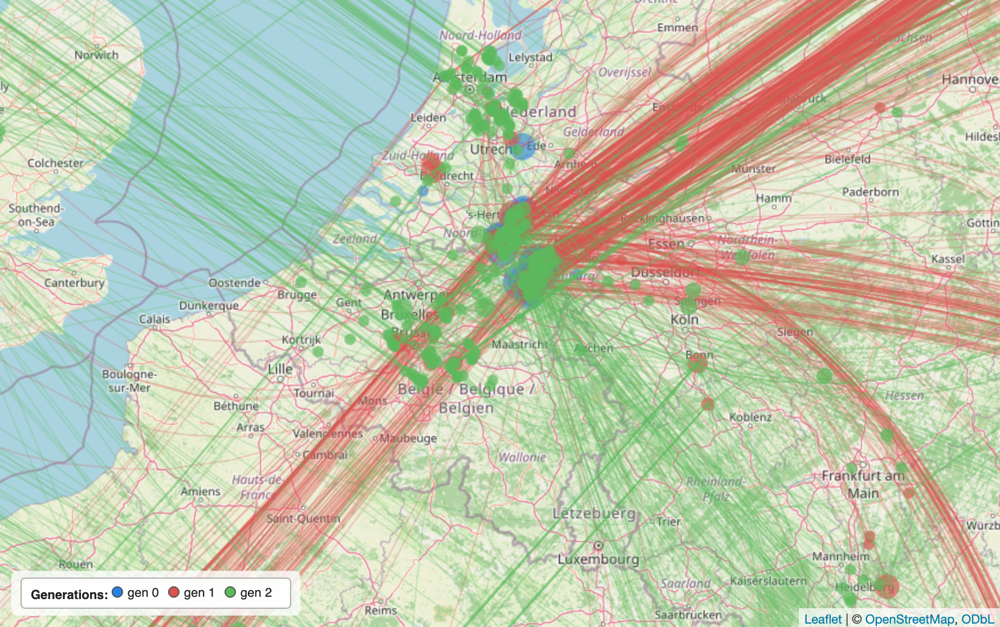

```{r setup, include=FALSE}
knitr::opts_chunk$set(echo = FALSE)
```

There is a [fascinating story about ASML](https://www.worksinprogress.news/p/how-asml-took-over-the-world?utm_source=%2Finbox&utm_medium=reader2) in *Works in Progress* that traces how a tiny Eindhoven spin-out came to dominate one of the most consequential technologies of our time.

A complementary way to look at ASML is through the lens of **knowledge spillovers** — the value that the firm's innovations create for *other* innovators down the line. Using the [Innovation Strategy Explorer](http://www.prinzproject.io/iseapp), we can put a number on this.

### ASML generates large global spillovers — but Qualcomm's are even larger

ASML innovations generate roughly **$16 million in average global spillovers** per patent family. That is well above the average Dutch patent. It is also, perhaps surprisingly, well below the average **Qualcomm** innovation that involves Dutch innovators:



[Interactive version](https://mondpanther-iseapp2.share.connect.posit.cloud/?_inputs_&country-sidebar=true&navbar_page=%22Country%20Explorer%22&country-inner_tabs=%22Value%20flow%20by%20firm%22&country-country=%22NL%22&country-firm=%22No%20firm%20filter%22&country-techs=%22All%20innovations%22&country-city=%22No%20city%20filter%22&country-toflow=%22ev_global%22&country-tech_categories_plot1=%5B%22Green%20Technology%22%2C%22AI%22%5D&country-firm_categories_sectors=null&country-widthscale=%22log%22&country-display_mode=%22confidence%22&country-granted_only=false&country-multifam_only=false&country-exclude_um=false&country-include_fallback=false&country-top_n_ids=10&country-topn=20&country-mininno=50&country-topn_rta=20&country-bottomn_rta=0&country-mininno_rta=0&country-minallinnos_rta=100&country-firm_categories_tree-search-input=%22asm%22&country-firm_categories_picked_persist=%22KONINKLIJKE%20PHILIPS%20N%20V%7C%7CASM%20INTERNATIONAL%7C%7CASML%20N%20V%7C%7CQUALCOMM%22).

### The Dutch picture reverses the ranking

The picture **reverses sharply** when we restrict the spillover benefits to *other Dutch innovators* only. Now ASML — together with neighbouring Eindhoven-region firms ASM International and Philips — dominates:



[Interactive version](https://mondpanther-iseapp2.share.connect.posit.cloud/?_inputs_&country-sidebar=true&navbar_page=%22Country%20Explorer%22&country-inner_tabs=%22Value%20flow%20by%20firm%22&country-country=%22NL%22&country-firm=%22No%20firm%20filter%22&country-techs=%22All%20innovations%22&country-city=%22No%20city%20filter%22&country-toflow=%22ev_nationalkey_2013_2022%22&country-tech_categories_plot1=%5B%22Green%20Technology%22%2C%22AI%22%5D&country-firm_categories_sectors=null&country-widthscale=%22log%22&country-display_mode=%22confidence%22&country-granted_only=false&country-multifam_only=false&country-exclude_um=false&country-include_fallback=false&country-top_n_ids=10&country-topn=20&country-mininno=50&country-topn_rta=20&country-bottomn_rta=0&country-mininno_rta=0&country-minallinnos_rta=100&country-firm_categories_tree-search-input=%22%22&country-firm_categories_picked_persist=%22KONINKLIJKE%20PHILIPS%20N%20V%7C%7CASM%20INTERNATIONAL%7C%7CASML%20N%20V%7C%7CQUALCOMM%22).

### Why?

Successful industrial strategy? Greater commitment by a local firm to its local innovation ecosystem? A more effective revolving door of local engineers and scientists? It's unclear at this stage — but you can see the pattern from "space" using **[HiGGlo](https://tinyurl.com/higglo)**, the friendly citation-network viewer.

The **direct and indirect citation network of Qualcomm** is dense and globally distributed:

<table>
  <tr>
    <th align="center">Qualcomm — global citation network</th>
    <th align="center">ASML — global citation network</th>
  </tr>
  <tr>
    <td>
      <br>
      <a href="https://mondpanther-iseapp2.share.connect.posit.cloud/?_inputs_&hglobe-gen0_select_mode=%22Random%22&hglobe-gen0_unit_mode=%22Number%22&hglobe-edge_select_mode=%22Random%22&hglobe-edge_unit_mode=%22Percent%22&hglobe-render_map=1&hglobe-next_step=1&hglobe-sidebar=true&navbar_page=%22HiGGlobe%22&hglobe-save_png=0&hglobe-copy_clip=3&hglobe-stop_generation=0&hglobe-country=%22NL%22&hglobe-firm=%22QUALCOMM%22&hglobe-techs=%22All%20innovations%22&hglobe-city=%22No%20city%20filter%22&hglobe-toflow=%22ev_nationalkey_2013_2022%22&hglobe-granted_only=false&hglobe-multifam_only=false&hglobe-exclude_um=false&hglobe-include_fallback=false&hglobe-gen0_sample_val=200&hglobe-edge_sample_val=100&hglobe-add_generations=1&hglobe-max_iter_nodes=50000&hglobe-map_zoom=2&hglobe-show_gen_0=true&hglobe-map_groups=%5B%22gen_0%22%2C%22gen_1%22%2C%22gen_2%22%5D&hglobe-show_gen_1=true&hglobe-show_gen_2=true">Interactive (Qualcomm)</a>
    </td>
    <td>
      <br>
      <a href="https://mondpanther-iseapp2.share.connect.posit.cloud/?_inputs_&hglobe-gen0_select_mode=%22Random%22&hglobe-gen0_unit_mode=%22Number%22&hglobe-edge_select_mode=%22Random%22&hglobe-edge_unit_mode=%22Percent%22&hglobe-render_map=1&hglobe-next_step=1&hglobe-sidebar=true&navbar_page=%22HiGGlobe%22&hglobe-save_png=0&hglobe-copy_clip=3&hglobe-stop_generation=0&hglobe-country=%22NL%22&hglobe-firm=%22ASML%20N%20V%22&hglobe-techs=%22All%20innovations%22&hglobe-city=%22No%20city%20filter%22&hglobe-toflow=%22ev_nationalkey_2013_2022%22&hglobe-granted_only=false&hglobe-multifam_only=false&hglobe-exclude_um=false&hglobe-include_fallback=false&hglobe-gen0_sample_val=110&hglobe-edge_sample_val=100&hglobe-add_generations=1&hglobe-max_iter_nodes=50000&hglobe-map_zoom=2&hglobe-show_gen_0=true&hglobe-map_groups=%5B%22gen_0%22%2C%22gen_1%22%2C%22gen_2%22%5D&hglobe-show_gen_1=true&hglobe-show_gen_2=true">Interactive (ASML)</a>
    </td>
  </tr>
</table>

ASML creates **more localised spillovers within the Netherlands** — even if many of these are indirect (the lighter, multi-hop edges in HiGGlo):

<table>
  <tr>
    <th align="center">Qualcomm — local spillovers</th>
    <th align="center">ASML — local spillovers</th>
  </tr>
  <tr>
    <td></td>
    <td></td>
  </tr>
</table>

### Take-away

ASML is a remarkable global champion, but its quieter contribution may be how much of its knowledge gets recycled *within* the Netherlands. Whether that comes from industrial strategy, local engineering culture, or just the gravitational pull of a single hub town remains an open question — but the data are now public enough to start asking it.

Explore the underlying data yourself with **[the Innovation Strategy Explorer](http://www.prinzproject.io/iseapp)** and the citation-network viewer **[HiGGlo](https://tinyurl.com/higglo)**.
