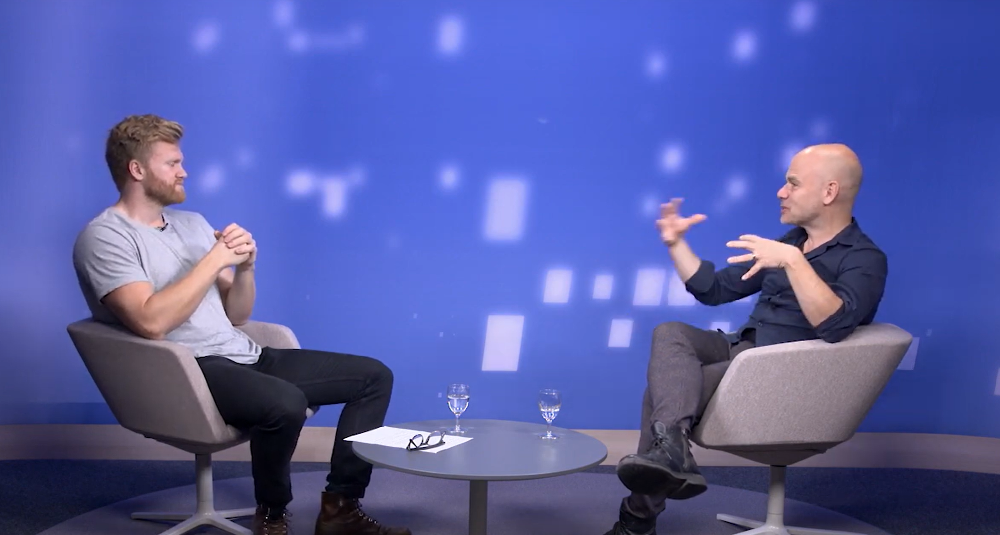

```{r setup, include=FALSE}
knitr::opts_chunk$set(echo = FALSE)
```


ETH's Luca Baltensberger was kind enough to sit down with me to discuss my study on [Environmental Preferences and Technological Choices: Is Market Competition Clean or Dirty?](https://www.aeaweb.org/articles?id=10.1257/aeri.20210014) Youtube video [here](https://www.youtube.com/watch?v=sRy0SX5VSaM). 




