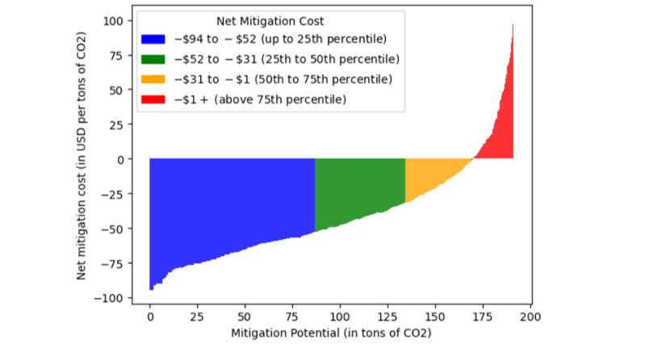

```{r setup, include=FALSE}
knitr::opts_chunk$set(echo = FALSE)
```

With increasing amounts of electricity generation from renewable sources such as solar and wind, there is increasing variation in both the emissions and costs of power production over narrow periods of time; e.g. over the course of a day.

This offers an opportunity to reduce both the cost and carbon intensity of power production if there is sufficient flexibility on the demand side of electricity market.

In a project joint with TATA power we have been offering Wifi enabled power switches to over 1000 Tata power household customers in Mumbai and Delhi along with financial incentives to participate in the scheme. Users could choose which devices to connect to the switches and most decided to connect an air conditioning unit.

We then explored how households responded to (random) remotely triggered switch off events of the connected devices. Households could always override these events but were incentivized not to.

Our research indicates that on average we can succesfully reduce overall household energy demand by 8% for short periods of time, 30 minute intervals say. This increases to over 15% particularly during more energy intensive afternoon and evening hours.

Further, we examine what would happen if we used this tool to strategically switch off people's devices at times when (marginal) carbon emissions are highest - which often coincides with periods where generation costs are high as well. Thus by doing so we can reduce both emissions as well as overall costs of generation. Comparing this to the costs of installing these devices - which are around \$25 - we can compute a carbon mitigation cost figure: i.e. how much do we have to spend to avoid a ton of CO2 emissions. It turns out that because cost savings from shifting consumption are a lot higher than the cost of installation for most households, that implies a negative cost of carbon mitigation: more than \$75 for some housholds; i.e. for every ton of CO2 saved, we also save up $75 via lower generation costs.

We also examine the emission reduction scale if a scheme like this would be rolled out among all smart meter customers of TATA in Mumbai and Delhi: over a 5 year period this could save us much as 85 thousand tons of CO2; i.e. approximately the equivalent of 85K transatlantic flights per passenger.

Further details in our [joint briefing with Tata Power](https://www.imperial.ac.uk/news/256213/towards-net-zero-imperial-collaborates-with/)





